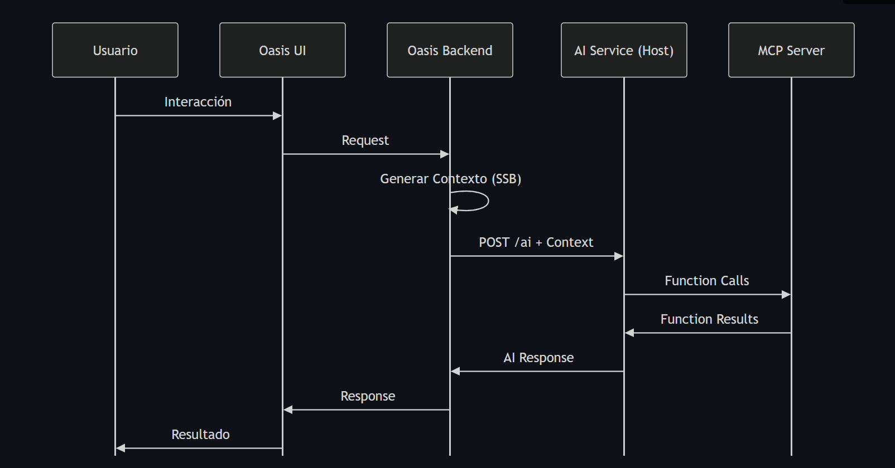
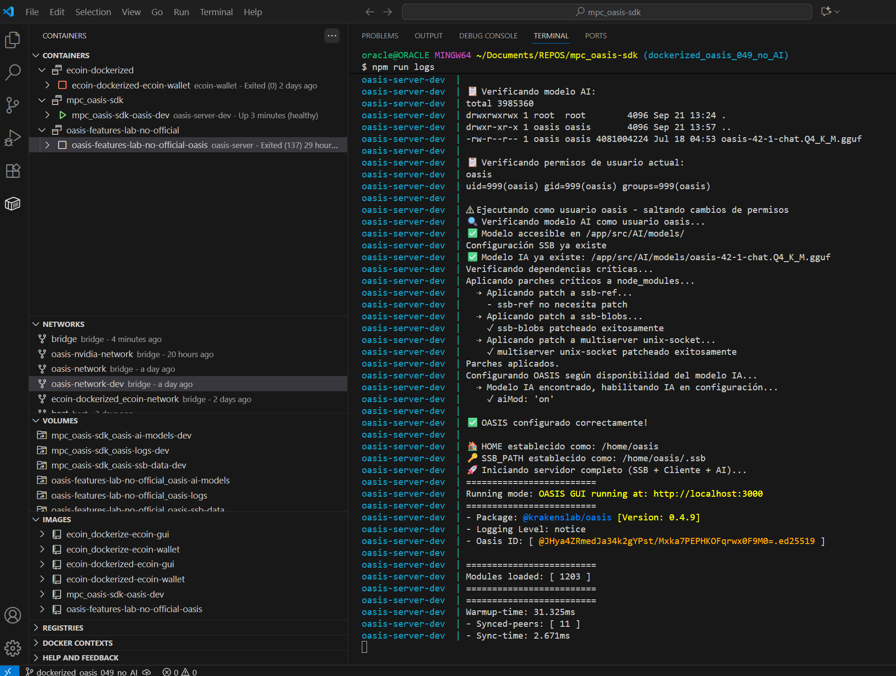
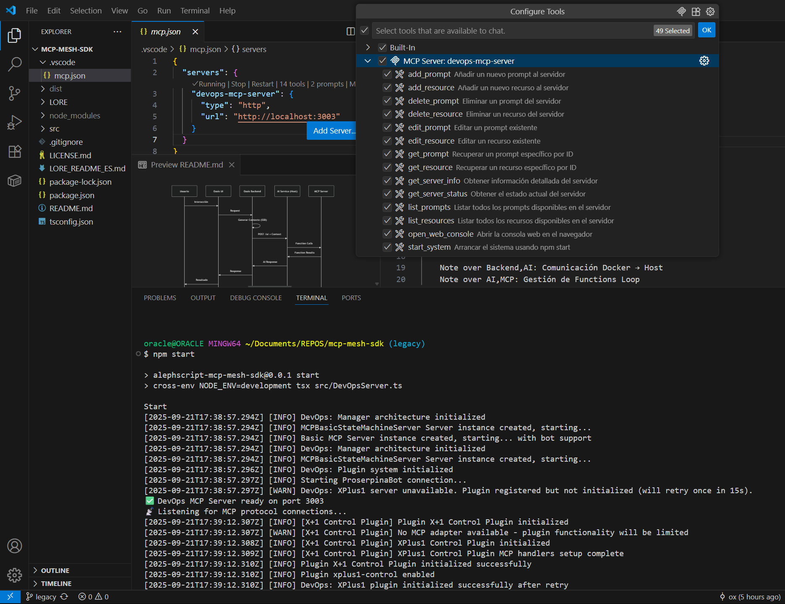
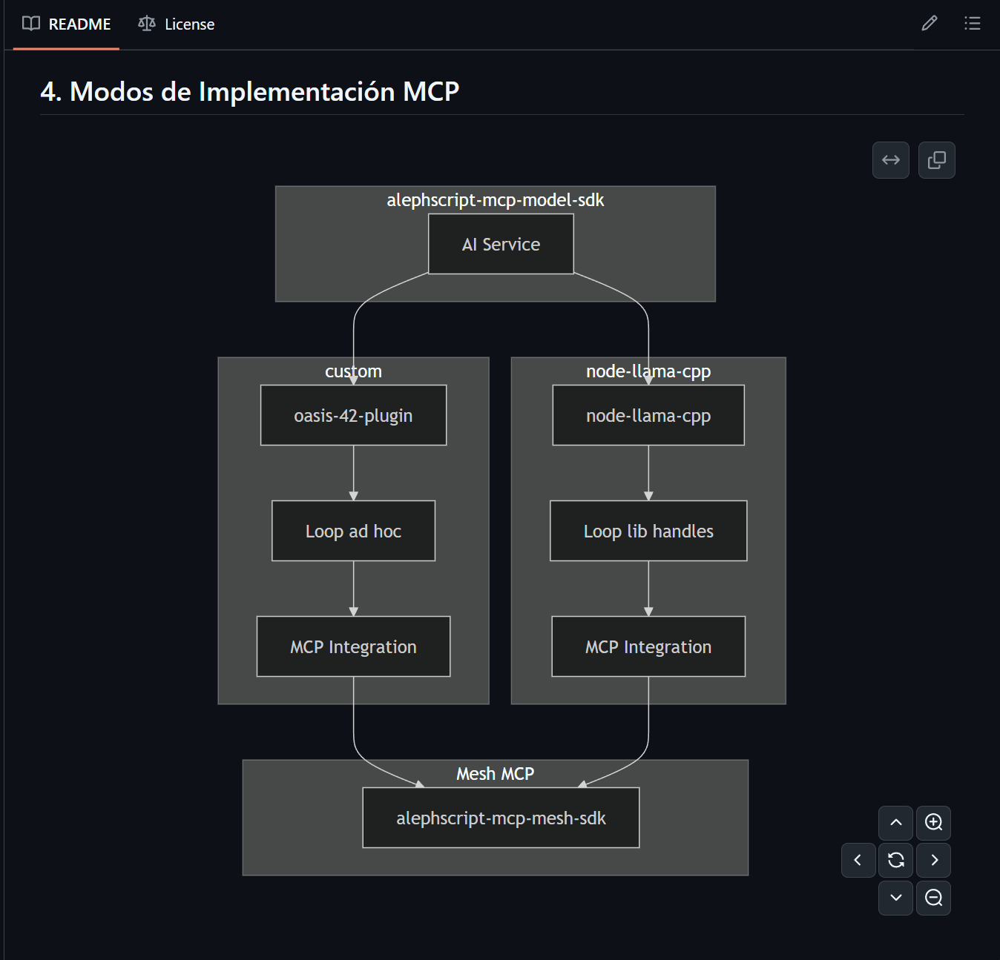
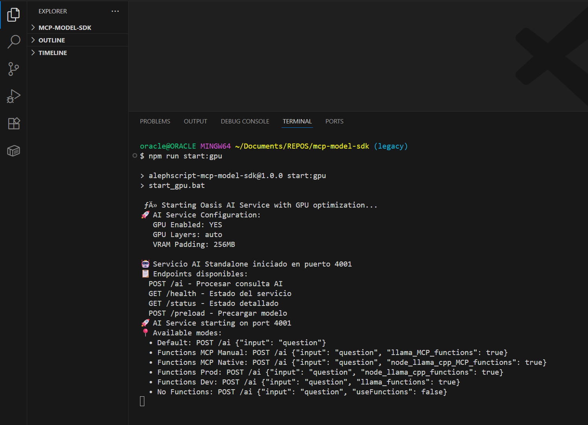
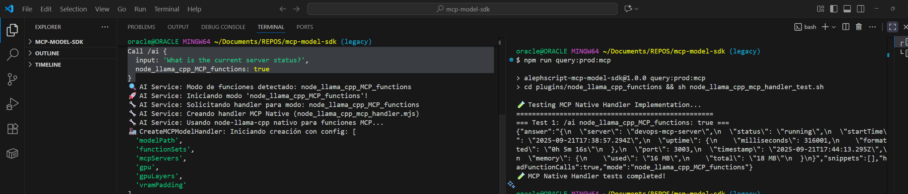
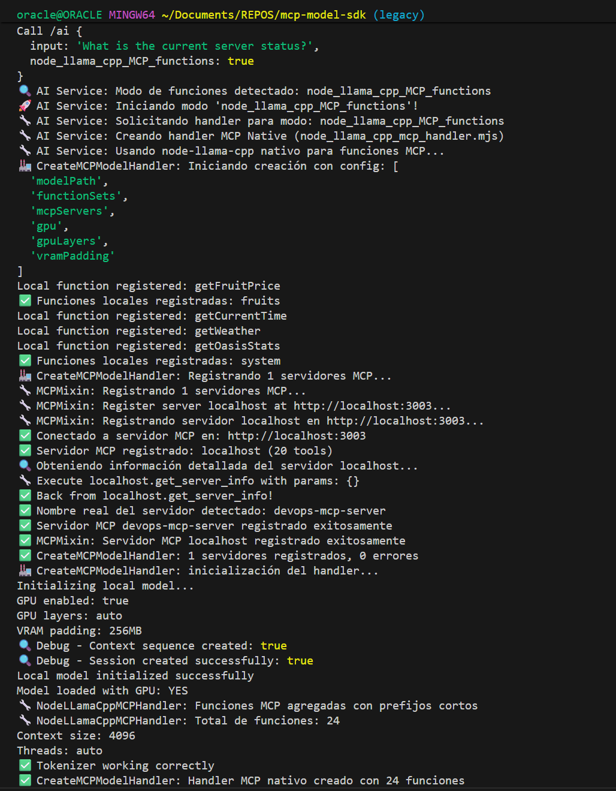
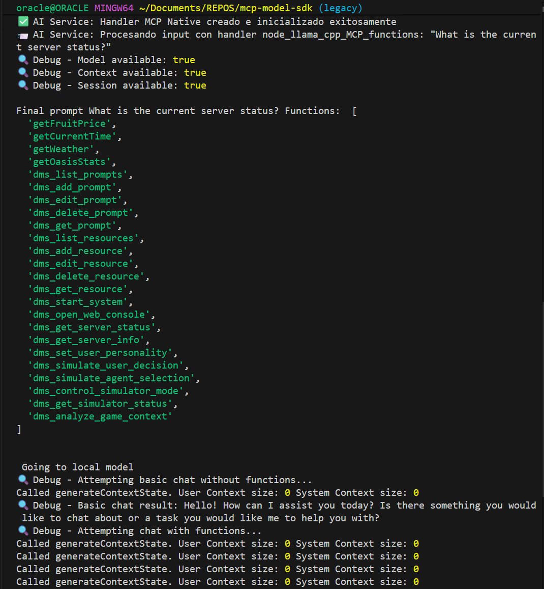
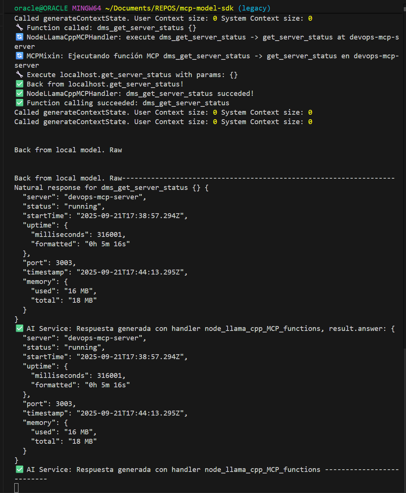

IMPORTANTE: Revisar términos de la [licencia](./LICENSE.md) antes de empezar a leer.

# Hacklab nº3 (sept 25)

Aquella solitaria fría tarde de domingo de principios de año nuevo (buscar palabras clave: "anticristo", "1888", "finales de septiembre") sabía que tenía algo entre manos que podría valer la pena. Me gustaba que el medio no tuviera competencia con el fin; que ambos estaban siendo cuidados.

Lo mejor de saber que no sabes nada, (parafraseando a Sócrates, antiguo filósofo de la Grecia), es que si tomas papel y lapiz (o IDE) y anotas lo que no sabes puedes componer un mapa (o proyecto) más o menos viable para solucionar ese problemilla de "no saber nada". Al saber que no sabes, sabes que tienes que montar un dispositivo de aprendizaje. Y, en esas, que tienes la oportunidad del Sapere Aude; ese mágico convenio sapiens de "atreverse" a saber. En perjuicio, claro, del no saber. La diferencia entre la ciencia y lo mismo pero con el prefijo nes-.

Este contexto es el que me sirve para presentar "los resultados" y "propósitos" del Hacklab nº3. A saber:

## Algunas panorámmicas



## Cosas releseables

### NET SDK



### MESH SDK



#### Modos



### MODEL SDK

#### Cómo arranca?


#### Qué hace?

A la izquierda el server. A la derecha un cliente manda un curl.



#### Detalles?




Según quién lo cuente, en mi opinión (aunque creo es evidencia compartida por muchos), el mismo pedazo histórico fue una cosa y otra. Pasa que al "contarlo" se enfoca aquí o acullá; se enfatiza esto o se omite lo otro. La idea de "actas" como registro escrito consensuado por todos viene al rescate. Pero, como sabemos, todo el trabajo "meta" a la postre se lo comen gente que tienen que incorporar a su coletario una coletilla que apostille: "¡El que la propone, se la comeee!".

Así, si Lucia cuenta cómo fue el Hacklab 3 (sept 2025) sobre el "aquende" o de las cosas cerquitas lo haría enlzando las [pic](./pics) que ella misma iba tomando cada hora o cada cuando se acordaba o cada cuando en la espiral de sucesos que ocurren en la sesión del hacklab se llegaba a un fulcro, como punto de engarce a otra cosa y, entonces, aprovechaba para sacar la foto "fin" del momento que acababa y la foto "ini" del momento que empezaba. Ella misma, Lucía, era participante así que en momentos de inmersión, obvio, no acudía a esta regla no escrita.

Si lo cuenta Diego, entonces, es el caso de esta hoja (hola, soy Diego, :-D). Este boceto lo enviaré a la revisa para el cuerpo del mes de septiembre máxime la última semana del mes.

Y, pues, ¿cómo lo cuento? ¿Cómo, en mi calidad de sujeto y observador, rehago la historia de lo que fue la sesión nº3 de los hacklab-stream de los viernes de la Revista Escrivivir.co? 

Pues, fácil: "Muy buenas ideas; atracón de vibecoding; y falta de voluntad 'deploy'; o sea, mucho 'build & start' pero poco 'npm pack & publish'".

Ideas que florecieron entorno al centro de interés propuesto y que intituló el evento "Mcp La 42 de SolarNetHub", "Ecoin Mr Robot", "ScuttleBot Oasis". Y, un poco lo de siempre. Todos hace "git clone". Muchos pasan de "install & start". Pocos necesitan hacer "build". Y, en este caso, nadie necesitó el pack. Aquí estoy, lector, vengo a que al final de este escrito hagamos juntos "pack & publish" y te quede la url de la "utilidad" o la cosa de valor que podrás, desde hoy en adelante, versionando semánticamente, agregar como librería a tu "stack".

En el atracón de vibecoding: ¡ojo que a veces un IDE con Copilot es como una tragaperras: "Esta vez me saca el código perfecto" y venga a tirar de "budget" sending with #codebase. Hay que evitar colocarse en la posición "tragaperras" que se limita a hacer click y ver los carros generar y editar ficheros o lanzar comandos y obtener logs. Hay que "sesudear" los prompts y aprovechar al máximo. Pero, bueno, luego comentamos: ¡impresiona lo que son capaces de hacer estos bichos!

Para lograr el objetivo, en lo que me declaro fan, hay que poner los ojos vueltos para adentro y entonces mirar qué se hizo y qué "commits" hay como ingredientes. La idea de "plato preparado" listo para sacar a mesa casa con la de hacer "pull request". Pero, en este hackaton solo hubieron 2 pseudo (porque era fake) así que no cuentan. Quedan por tanto los "commits" que son como los "ingredientes" que hoy, lector, si te quedas, haremos taller de cocina digital. Sea pues, objetivo: ¿qué ingredientes tenemos? ¿Qué receta haremos con ellos?

Los ingredientes principales están en 3 repositorios:

- Lab: este fue el que tiene el fork original de Oasis (tanto de github como de kraken).
- mcp-oasis-sdk: este tiene una dockerizacion de oasis; así como la contraparte para usar mcp-model-sdk en lugar de su homólogo en oasis.
- mcp-mesh-sdk: este tiene los commits relacionados con MCP server
- mcp-model-sdk: este tiene la extraccion del AI 42 de Oasis a standalone


¿Qué opinas, lector, se entiende, no?

Primero, en el lab, estuvimos unas horas cacharreando con el ForkOasis v 0.4.9 (ya ha salido la 0.5!!!). Vimos que es fácil dockerizarlo (y lo hicimos). Y vimos que no tan trivial (aunque si muy recomendable) dockerizar con GPU. Así que nuestra 42 en este entorno solo corre con CPU y necesita del orden de minutos para operar.

Un fork de lo anterior es una dockerizacion para nvidia que tiene muchos problemas para coordinar una distri de nvidia que venga con CUDA 12 para NPM:node-llama-cpp. Si bien esta librería es muy versátil a la hora de identificar en qué contexto corre y de bajarse o compilar lo que necesite, dentro de docker es un poco más "restrictivo" y cuesta.

Consecuencia de lo anterior, el lab buscó el bisturí y extrajo con precisión quirúrgica el módulo AI de oasis para correrlo standalone en el host. Así, cuando Oasis busque el servidor AI tendrá que usar la ip tipica con que Docker identifica al host en las redes. ¿Qué implicó esto?

El servicio backend de Oasis lanza el servicio AI en un spawn al puerto 4001 por lo que por esa parte la extracción no presentó problemas.

Sin embargo, el proceso de la 42 para por recibir una post a la ruta '/ai' con un 'input' que tiene le prompt del usuario. El backend entonces, usa un módulo para construir el contexto de la 42 (la producción y gestión tanto del historial como de los snippets y mensajes de la red scuttlebot asociados) que, por tanto, depende de ssb. Para poder extraer el servicio IA, se delegó al backend la producción del contexto que entonces se envía al servicio IA externo ya sin dependencias ssb.

Una vez que el lab tuvo la posibilidad de correr a la 42 de Oasis tanto dentro de la UI de Oasis como fuera la actividad se orientó a la última fase y objetivo del hacklab: "hacer algo mcp con la 42 de Oasis".

He limpiado el código y han salido 2 vías (dobles) como modos en los que podemos "mcpear" al servicio AI de Oasis, y que tienen que ver con quien gestiona el bucle de "functions".

- Lo hace la librería NPM:node-llama-cpp
- Lo hacemos nosotros.

Aleph hizo lo del proceso quirúrjico de extracción con el paquete MCPServers y MCPDrivers de [state-machine-mcp-driver](repo). Martin y Teresa hicieron lo propio con los ingredientes recolectados:

IMPORTANTE: Revisar términos de la [licencia](./LICENSE.md) antes de usar estos códigos.

- Dockerized Oasis 049: https://github.com/escrivivir-co/alephscript-network-sdk
- AI: https://github.com/escrivivir-co/alephscript-mcp-model-sdk
- MCP: https://github.com/escrivivir-co/alephscript-mcp-mesh-sdk

Al final el proceso es:

- Setup la NET
- Setup el MCP
- Setup la AI
- Play from NET-Web (Oasis Social Net Hub) (or from dev)


## Setup la NET

Al final, se trata de poner el Docker Desktop, clonar el repo, hacer el setpup; y familiarizarse con el build, up/down, start/stop. Lo más difícil es decidir si quieres o no montar volumenes de datos para tener más o menos acceso a los datos del Oasis. Una vez up, npm run web y ¡Oasis!

## Setup el MCP

Las tareas son específicas de enlazar los servers. Al final, la mesh es un servidor mcp que tiene un grafo de otros servidores mcp. Cuando el SLM O42 debe responder será ofrecido de unas herramientas que si quiera podrá usar. Esas herramientas estarán locales en el servicio AI, en un servidor MCP de tipo DevOps, y, de ahí, anywhere.

Sea como fuere: git clone, npm i, npm start. Luego: npm inspect (que abre la tool oficial de Anthropic para ver tools, resources y prompts). Clave: conexión 'http://localhost:3003' tipo http. Opcional en Vs Code, fichero .vscode/mcp.json donde configuras la misma url y accedes a configuración visual o uso con Copilot.

## Setup la AI

Oasis 42 no está entrenada especificamente para usar functions. Por tanto los prompts deben incluir instrucciones para que lo haga. El uso de funciones (que puede extenderse a otras formas de contexto como recusos de datos o prompts) se hace con un bucle en:

Se le pasa a la AI el prompt + instrucciones + lista de funciones; si en la respuesta hay petición de ejecución de función entonces repetir agregando al prompt el resultado de la ejecución (esto aplica a n funciones). Si no, acabar.

Este bucle, por ejemplo, puede ser programdo o usar alguna implementación como la de NPM:node-llama-cpp. Una función es, entonces: la definición del esquema de parámetros de entrada y salida en formato JSON, un handler con la acción.

La dificultad entonces estriba en:

- Identificar la construcción de contexto en Oasis
- Identificar la persistencia de la conversación en Oasis
- Completar las instrucciones functions ocn las del contexto de Oasis
- Retornar a Oasis.

## Play from NET-Web (Oasis Social Net Hub) (or from dev)

Se puede hacer desde la web o con postman o usando numerosos archivos bash con llamadas tipo en curl; o, por qué no, con Copilot en VS Code.


### ¿Se puede instalar todo desde 0?
Seguro que se podría, pero de momento lo que hay es la base de lab que se ha ido montando. Para probar.

### ¿Se puede arrancar y ejecutar la secuencia de prueba?
Sí, tira bien la cosa. Éxito.

Todos los scripts de tipo "query" del package.json de alephscript-mcp-model-sdk "hacen algo". Mejor o peor, pero lo hacen. Eso sí, es urgente refactorizar la estructura del servicio para la gestión correcta del modelo ya que ahora cada "handler" carga su propia instancia. Además, es necesario un mecanismo de shutdown grácil porque no es conveniente matar el proceso del nodejs con todo eso cargado en la GPU o la CPU.

Y en la web, en la ruta /ai se envía el mensaje y la respuesta llega aunque... (se necesista: Mejor prompt context pattern entre Oasis y el as-model-sdk).

### ¿Entonces? ¿Cómo queda?

#### Mejor prompt context pattern entre Oasis y el as-model-sdk

Tras el conexionado dummy que se ha hecho, cuando se envía una petición a 42 llega este payload a as-mcp-model-sdk/ai_Service:

```js
{
  input: 'What is Oasis?',
  context: '[CONTEXT][/CONTEXT]\n' +
    'Consulta específica: "What is Oasis?"\n' +
    'Palabras clave: what, oasis?',
  prompt: 'Provide an informative and precise response.'
}
```

Luego, además, se junta con la info de las tools, esto hace que retorne garbage porque se sale de cualquier carril conocido, :-D. Sin embargo, esto no es trivial ya que, i.e., estamos trabajando con el ingenio de la 0.4.9 y en la 0.5.0 el algoritmo ha cambiado. Por tanto no se trata tanto de definir una estructura de mensajería como integrar el proceso:

```mermaid

```

#### Refactorizar la estructura del servicio para la gestión correcta del modelo

La forma en la que se crea el objeto llama determina la funcionalidad CPU/GPU.

Sin embargo el modelo propiamente dicho y la sesión así como el prompting pueden compartirse. Hay que crear stacks para casos gradando si hay recursos o no.

#### Mecanismo de shutdown grácil

En entornos de mierda, como por ejemplo el famoso "Ventanas", es habitual que el Ctrl+C que haces en la consola de tu servidor nodejs además de parar tu servicio AI te reviente el sistema operativa. Ahora, puede salirte tanto la pantalla azul como la negra. Pero es dead seguro. Una route de "down" sería imprescindible para el dispose de las instancias llama.
