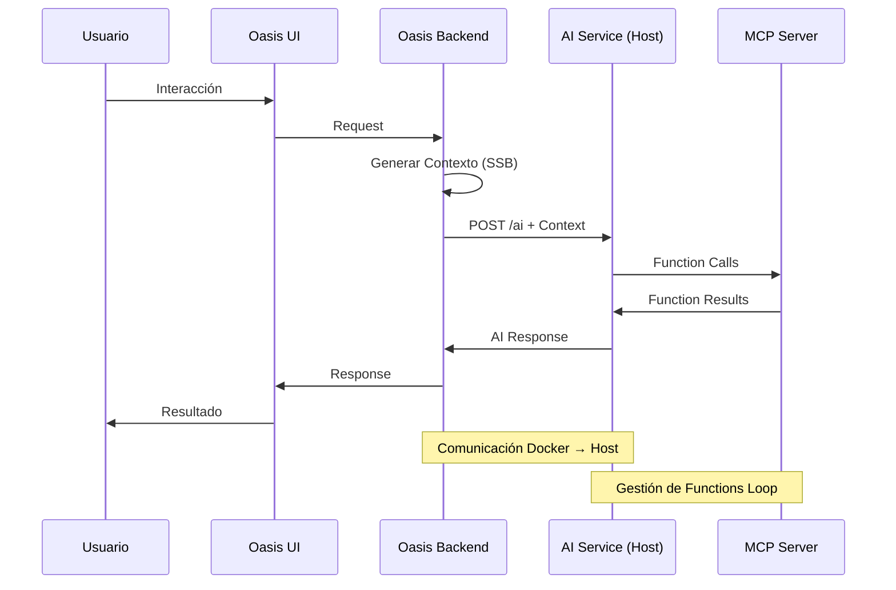
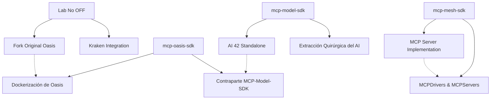
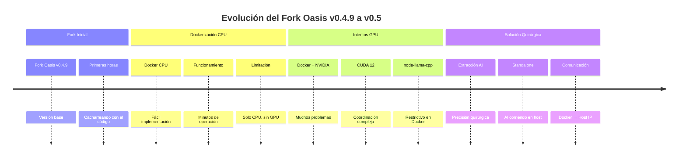
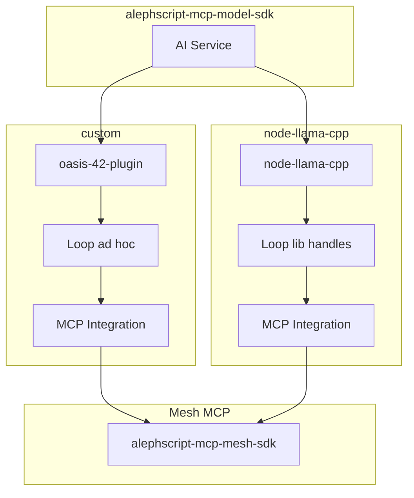

NOMBRE EN CLAVE / KEY NAME: MCPGaia 

```mermaid
sequenceDiagram
    participant User as Usuario
    participant UI as Oasis UI
    participant Backend as Oasis Backend
    participant AI as AI Service (Host)
    participant MCP as MCP Server
    
    User->>UI: Interacción
    UI->>Backend: Request
    Backend->>Backend: Generar Contexto (SSB)
    Backend->>AI: POST /ai + Context
    AI->>MCP: Function Calls
    MCP->>AI: Function Results
    AI->>Backend: AI Response
    Backend->>UI: Response
    UI->>User: Resultado
    
    Note over Backend,AI: Comunicación Docker → Host
    Note over AI,MCP: Gestión de Functions Loop
```

## 1. Arquitectura de Repositorios

```mermaid
graph TD
    A[Lab No OFF] --> B[Fork Original Oasis]
    A --> C[Kraken Integration]
    
    D[mcp-oasis-sdk] --> E[Dockerización de Oasis]
    D --> F[Contraparte MCP-Model-SDK]
    
    G[mcp-mesh-sdk] --> H[MCP Server Implementation]
    G --> I[MCPDrivers & MCPServers]
    
    J[mcp-model-sdk] --> K[AI 42 Standalone]
    J --> L[Extracción Quirúrgica del AI]
    
    B -.-> E
    K -.-> F
    H -.-> I    

```

## 2. Evolución de la Dockerización

```mermaid
timeline
    title Evolución del Fork Oasis v0.4.9 a v0.5
    
    section Fork Inicial
        Fork Oasis v0.4.9 : Versión base
        Primeras horas : Cacharreando con el código
        
    section Dockerización CPU
        Docker CPU : Fácil implementación
        Funcionamiento : Minutos de operación
        Limitación : Solo CPU, sin GPU
        
    section Intentos GPU
        Docker + NVIDIA : Muchos problemas
        CUDA 12 : Coordinación compleja
        node-llama-cpp : Restrictivo en Docker
        
    section Solución Quirúrgica
        Extracción AI : Precisión quirúrgica
        Standalone : AI corriendo en host
        Comunicación : Docker → Host IP
```

## 4. Modos de Implementación MCP

```mermaid
graph TD
    subgraph "alephscript-mcp-model-sdk"
        AI42[AI Service]
    end
    
    subgraph "node-llama-cpp"
        NLC[node-llama-cpp]
        FL1[Loop lib handles]
        MCP1[MCP Integration]
        
        AI42 --> NLC
        NLC --> FL1
        FL1 --> MCP1
    end
    
    subgraph "custom"
        SELF[oasis-42-plugin]
        FL2[Loop ad hoc]
        MCP2[MCP Integration]
        
        AI42 --> SELF
        SELF --> FL2
        FL2 --> MCP2
    end
    
    subgraph "Mesh MCP"
        MCP2 --> SMD[alephscript-mcp-mesh-sdk]
        MCP1 --> SMD[alephscript-mcp-mesh-sdk]
    end

```